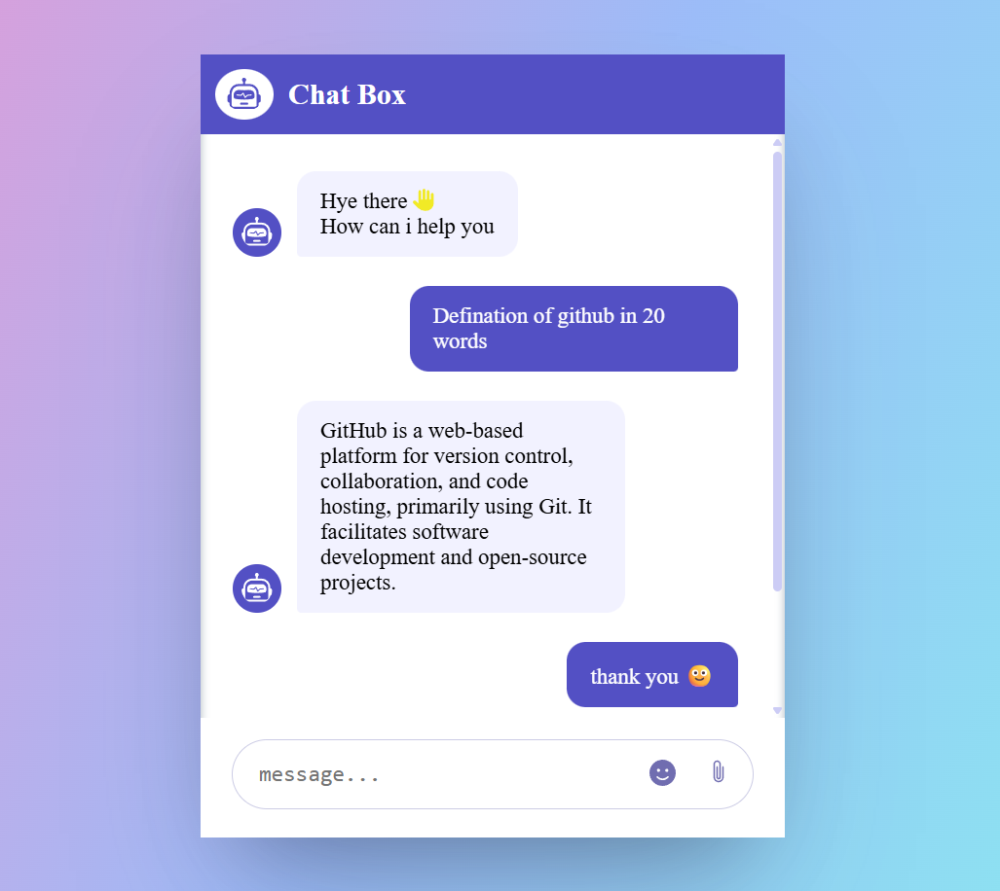

# 💬 Chatbox App

A responsive and interactive AI chatbox UI built using **HTML**, **CSS**, and **JavaScript**. It features a stylish layout with emoji picker, file preview, AI response typing animation, and a clean message flow design.

 🚀 Features

- 🧠 Chatbot UI layout (frontend only)
- 📎 File upload with preview
- 😊 Emoji picker integration
- 🧠 AI typing indicator animation
- 📱 Responsive design
- 🌈 Gradient background with modern UI

 🖼️ Preview

 📁 Folder Structure

 ChatBox/
│
├── index.html
├── style.css
├── script.js

 🛠️ Technologies Used

- HTML5
- CSS3 (Flexbox, Animations)
- JavaScript (DOM manipulation)
- [em-emoji-picker](https://github.com/nolanlawson/emoji-picker-element) for emojis

 ## 🔧 Setup Instructions

### ▶️ Open `index.html` in your browser

No server or build tools required. It's a fully static project — just open the file and start chatting!

---

## 🌐 Live Demo

> *(Add your deployed link here - optional)*  
🔗 [Live Chatbox Demo](https://your-live-link.vercel.app)

---

## 📌 Future Enhancements

- 🤖 Integrate with Gemini / ChatGPT API for real AI replies  
- 💾 Store chat history using `localStorage` or a backend database  
- 🔐 Add user authentication with login/signup

---

## 🙋‍♀️ Author

**Harshita Kh**  
🔗 [GitHub Profile](https://github.com/harshita-kh-25)
